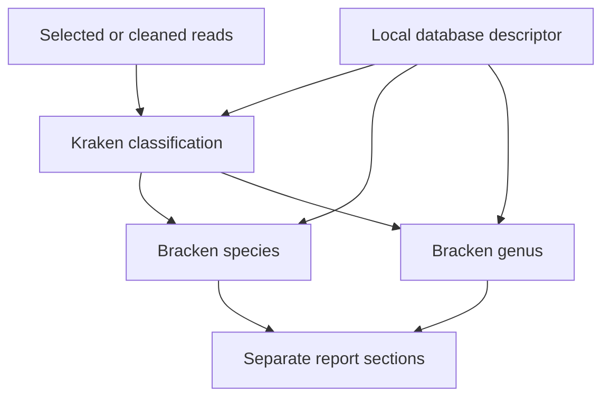

# Kraken2 and Bracken local metagenomics

**Exact-final release status, 2026-10-04:** [Kraken2 1.0.0](https://github.com/comparativechrono/workbench/releases/tag/pack-kraken2-v1.0.0)
and [Bracken 1.0.0](https://github.com/comparativechrono/workbench/releases/tag/pack-bracken-v1.0.0) passed their native Windows
installation, graph/archive and scientific gates in ordinary and
space-containing paths. Bracken's gate included a real Kraken2-to-Bracken chain.
All final public assets were independently downloaded and rehashed. The
[dated repository evidence](../knowledge/current-state.md#kraken2-and-bracken-exact-final-evidence)
records exact hashes, workflow commits and limitations. Earlier companion
snapshots retain their historical creation-time status.

The release records below apply to the exact published 1.0.0 archives.
Source-only, graph-only and candidate tests remain separate evidence; they
do not by themselves establish exact-final native Windows success.

These are separate optional packs for the unchanged **Workbench 0.6.0**
application. Kraken2 classifies reads against a selected local database; Bracken
estimates taxonomic abundances from a Kraken report using that database's
read-length-specific distribution. Both retain the pinned upstream scientific
implementations. The application and its starter tools remain separate.

| Pack | Supported operations | Main outputs |
| --- | --- | --- |
| [Kraken2](KRAKEN2-PACK.md), `kraken2` | Register an existing local database; prepare a selected local database archive; classify single FASTQ reads or paired FASTQ mates | Reusable database descriptor; classification record; ordinary Kraken report and assignments; provenance |
| [Bracken](BRACKEN-PACK.md), `bracken` | Estimate from a Workbench Kraken classification record; estimate from an explicitly declared external Kraken report and distribution | Abundance table, Bracken report, provenance and methods |

The source pins use Kraken2 **2.17.2** and Bracken **3.1**. Refer to
the individual pack's source lock, guide and validation record for its exact
pack version, supported operations and tested bytes. Bracken's upstream v3.1
tag contains a launcher that still prints 3.0.1; this pack invokes the v3.1
`est_abundance.py` directly and records its exact hash.

## Installable tools and selected databases

A **pack ZIP** installs executable software through **Manage tools → Import
pack ZIP**. A **database resource** is a separate selected local input. Large
public reference databases are not bundled into the application or copied into
each classification result. A database descriptor records the selected local
files, source/release information and content hashes. A hash establishes content
identity, not publisher authenticity or biological completeness.

Use Kraken2's database-registration operation when the database is already
extracted. Its selected anchor is `hash.k2d`; the matching `opts.k2d` and
`taxo.k2d` must be available alongside it. Supply an honest database label, source
and release. Select corresponding Bracken distribution files when available.
Alternatively, the archive-preparation operation extracts a supported local
database archive into its result folder and produces the descriptor. Keep those
files with that result; the descriptor is not a self-contained database backup.

Database construction from downloaded taxonomy/reference sequences and
generation of new Bracken distributions are outside these supported operations.
Preparing or registering files does not run those scientific database builders.
There is no hidden network retrieval during an analysis. Obtain any needed
reference resource separately, preserving its published provenance and terms.

Database memory and storage can dominate the workload. Memory mapping avoids a
separate full in-process hash-table copy, but does not make the working set small
or guarantee acceptable performance on a low-memory laptop. Choose a database
appropriate for both the experiment and the available machine. These fixture
gates do not establish whole-database throughput or memory requirements.

## Assemble a classification and abundance pipeline

1. Select a registered database descriptor and single-end reads or an atomic
   read-1/read-2 pair. Plain or gzip four-line DNA FASTQ with Phred+33 qualities is
   supported. The adapter validates and privately stages reads; plan temporary
   disk space for decompressed inputs. A filename or graph connection does not
   prove valid reads.
2. Optionally connect a read-preprocessing operation. The existing fastp pack's
   cleaned pair feeds paired Kraken classification. Its retained unpaired reads
   can feed a separate single-read classification. Keep those populations and
   count units explicit when reviewing their results. Retained orphan files can
   be empty; omit that branch when no reads remain, since this classification
   operation requires at least one observation.
3. Connect Kraken's **classification record** output to Bracken's **classification**
   input. Select the same database descriptor at both operations. The record
   binds the sibling Kraken report to its database identity, observed reads,
   count unit and classifier settings.
4. Choose the Bracken rank, minimum count threshold, distribution read length
   and read-length policy. Species and genus estimates may share one Kraken
   record and database. They are separate branches at the same dependency level.
5. Add Workbench reporting to collect the selected summaries as separately
   labelled sections. Review input sources, planned methods and the DAG before
   running. Saved pipelines pin exact pack versions and manifests; one operation
   saves as tool settings instead of a pipeline.

The branches are drawn at the same DAG level. Workbench 0.6.0 still schedules
independent branches sequentially. Reports do not combine species and genus
counts into one total, and do not pool different biological samples.

## Interpretation and compatibility

Kraken's paired operation counts **fragments**, with one classification per
read pair. Its single operation counts **reads**. Bracken preserves the declared
unit. Neither a graph connection nor a common filename establishes that two
datasets represent the same sample.

The Bracken record-based operation requires Kraken confidence 0,
minimum hit groups 2, minimum base quality 0, and no quick mode. Those are the
settings represented by this pack's supported distribution contract; changing
Kraken settings can still produce a Kraken result, but may make it unsuitable
for this Bracken operation. A confidence threshold is not a calibrated
probability that a taxonomic call is correct.

The default **exact** length policy requires the observed read lengths to match
the selected distribution. Trimming often makes lengths variable. Selecting
**representative** length is an explicit approximation within the observed
range; it does not fit a mixture of read-length distributions or make arbitrary
long-read data equivalent to a fixed-length library. Keep the chosen policy in
the methods description.

Bracken's fraction denominator is its retained estimated abundance before
per-taxon integer truncation. It does not include every unclassified or
unallocated input observation. Retain the upstream table and its denominator
description; do not relabel those fractions as proportions of all input reads.

The external-report operation works without the Kraken2 pack, but requires an
ordinary six-column Kraken report, the intended distribution, explicit database
label/release, count unit and confirmation of the matching settings. This is
user-attested provenance. It cannot reconstruct a missing report-to-database
history or independently establish that the selected distribution was built
from the claimed database.

Released Workbench 0.6.0 represents database descriptors, classification records
and distributions as generic **file** ports. It represents reports/abundance
tables as **metrics**. It rejects expressible read/pair/report type mismatches,
but two generic-file connections can still be swapped in a graph. Runtime
resource/record validation remains necessary. Database identity is separate
from database suitability for the organism, assay or research question.

The [resource contract](METAGENOMICS-RESOURCES.md) documents descriptor fields,
relocation, archive preparation and integrity checks. Bracken verifies the
retained report and selected distribution without opening unused Kraken index
files. Kraken classification hashes the database before and after its run; allow
for that I/O cost when selecting a large database.

## Evidence and maintenance

`tests/test_metagenomics_pipeline.py` uses the unchanged released 0.6.0 starter,
checks its SHA-256, and verifies application source/bridge bytes in two disposable
applications. The first contains only starter and selected packs; the second
adds pinned prerequisites for connections. Its archive tests use the released
Python pack manager with a checked **copy callback**, not native folder
publication. It never executes Kraken2, Bracken or fastp.

The graph gate checks standalone discovery and declared scientific assertions,
tool settings versus pipeline saves, exact version/manifest pins, named input
provenance, DAG branch levels, schema-expressible mismatches, archive payload
identity, duplicate-version rejection and preservation of installed files and
receipts. It explicitly demonstrates the generic-file validation limit.

Gate configuration and dependencies are documented at the top of the test:

| Selection | Required archives | Expected test count |
| --- | --- | --- |
| `NW_METAGENOMICS_PACK_IDS=kraken2` | Starter, selected Kraken2, pinned published fastp 0.4.1 | 6 |
| `NW_METAGENOMICS_PACK_IDS=bracken` | Starter, selected Bracken, separately pinned final Kraken2 | 7 |
| `NW_METAGENOMICS_PACK_IDS=kraken2,bracken` | Starter, both selected packs, pinned published fastp 0.4.1 | 9 |

Run in a fresh process with `python tests/test_metagenomics_pipeline.py --report
PATH.json`. Each selected pack uses `NW_METAGENOMICS_<ID>_VERSION`, `_ARCHIVE`, and
optional `_PACK_DIR`; without `_PACK_DIR` the exact archive supplies the graph
fixture. Bracken-only gates additionally require the dependency
`NW_METAGENOMICS_KRAKEN2_SHA256`. Missing CLI prerequisites or skipped tests must
fail the gate. See the script for starter, temporary-folder and dependency-path
overrides.

Native Windows installation, scientific regressions, the real Kraken-to-Bracken
chain and exact-final archive validation are separate required evidence. Preserve
failed candidates, source/build provenance, licensing and final public-asset
verification. No small fixture or native command-line gate establishes desktop
GUI acceptance, clinical validity or accuracy for all metagenomic communities.

Upstream references: [Kraken2 manual](https://github.com/DerrickWood/kraken2/wiki/Manual),
[Bracken repository](https://github.com/jenniferlu717/Bracken), and
[Bracken manual](https://www.ccb.jhu.edu/software/bracken/index.shtml?t=manual).
