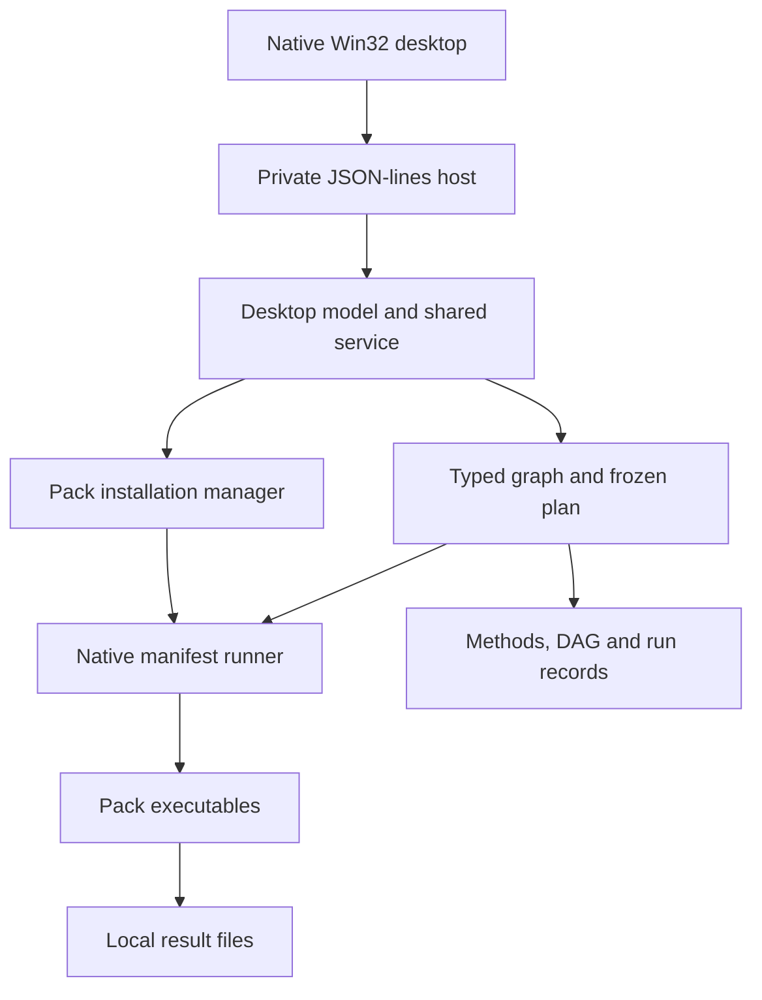

# Current architecture

**Current extension, 2026-10-09:** unpublished 0.16.0 adds application-owned exactly pinned synthetic workflows (`curated_workflows.py`) and read-only provenance-checked results (`results_summary.py`). The native catalogue/search dialogs use the existing private host. See the [feature contract](curated-workflows-results.md) and [handover](curated-workflows-results-0.16.0-handover.md); old versioned paragraphs below retain their original scope.

This describes the reference-discovery, native interface and results-export
implementation, with reference-management extensions under development on 2026-10-08.
Versioned release paragraphs retain their historical evidence. It is a map of
the implementation, not a claim that every deployment or scientific use has been
validated. Start with [the knowledge index](README.md).

**Release scope, 2026-10-06:** 0.9.0 adds a frozen packed CWL result, routes
SVG/native DAG edges around cards and builds the native application icon from
repository SVG. Exact application source `beea34a` passed the recorded
source/interoperability and packaged Windows gates, was accepted by the user and
was published without rebuilding. The separate updater from 0.8.0 also passed
its native preservation and post-update execution gate. See
[CWL results and presentation](cwl-results.md) and the
[release handover](cwl-dag-icon-0.9.0-handover.md) for exact identities, retained
validator failures, publication checks and limits.

The 0.8.0 native three-pane interface, independent standalone/workflow editing
sessions and bounded connection previews remain described in the
[native UI guide](native-ui.md). Its [release evidence](native-ui-0.8.0-release-handover.md)
and the published 0.7.0 artifacts remain unchanged.

## What runs on a user's machine

The current application is a native Windows x86-64 desktop program. It bundles
its own Python interpreter and launches declared scientific executables as local
processes. It does not boot Linux, run a virtual machine, translate arbitrary
Linux binaries, or require a browser, system Python, Docker or WSL.

The transport between the desktop and its Python child is anonymous stdin/stdout
pipes, not HTTP. `desktop/desktop_ipc.cpp` launches
`runtime/python/python.exe -I -u workspace/desktop_host.py --app-root <root>`.
The isolated embedded interpreter imports application modules from the installed
workspace directory. The native parent owns a kill-on-close Windows Job Object
containing the host and descendants. Request IDs correlate replies; slow
operations may finish out of order. Diagnostics go to
`user-data/desktop-host.stderr.txt`. Treat host shutdown, cancellation and pipe
EOF handling as lifecycle contracts, not incidental UI behavior.

`NativeBackend` in `workspace/engine.py` starts
`WorkbenchBridge.exe run --request <file>` for a
pack operation. The bridge rechecks the manifest and uses the existing native
runner. Commands are argument arrays expanded from trusted pack declarations;
the UI and graph cannot submit arbitrary shell command strings. Binary process
pipes are handled by the native runner, including both subprocess outcomes.

The GUI build target is `build/desktop/DesktopWorkbench.exe`; the release
packager installs it as `NativeWorkbench.exe`. All three native build resource
versions are 0.15.0 in the active development tree; published 0.11.0 is unchanged. Application version is maintained in `workspace/app_version.py`
and release metadata, independently of pack versions and pack API compatibility.

## Responsibilities and source map

| Location | Responsibility |
| --- | --- |
| [`desktop/desktop_workspace.cpp`](../desktop/desktop_workspace.cpp) | Current Win32 interface, tool library, forms, graph drawing and native dialogs. |
| [`desktop/desktop_ipc.cpp`](../desktop/desktop_ipc.cpp) and header | Bounded JSON parsing, private host process, request transport and process-tree ownership. |
| [`workspace/desktop_host.py`](../workspace/desktop_host.py) | JSON-lines request validation and dispatch; no listening network service. |
| [`workspace/desktop_model.py`](../workspace/desktop_model.py) | UI-independent editing actions, compatible connections, selection, input provenance and ranked graph snapshots. |
| [`workspace/service.py`](../workspace/service.py) | Shared lifecycle, background work, history, saved pipelines/presets, pack operations and installation checks. |
| [`workspace/catalog.py`](../workspace/catalog.py) | Strict manifest/schema parsing, installed operation discovery, semantic types and exact-version resolution. |
| [`workspace/engine.py`](../workspace/engine.py) | Graph validation, biological preflight, plan freezing, hashing, scheduling, native backend, methods and SVG/report generation. |
| [`workspace/sample_table.py`](../workspace/sample_table.py) | Bounded CSV/TSV parsing, explicit column bindings, isolated per-sample graph copies and combined-report previews. |
| [`workspace/run_queue.py`](../workspace/run_queue.py) | Durable queue receipt, OS ownership lease, frozen plan/companion inventory and atomic state persistence. |
| [`workspace/reference_indexes.py`](../workspace/reference_indexes.py) | Content-addressed index identities, complete inventory verification, crash-released per-key lease and verified copy into results. |
| [`workspace/cwl_export.py`](../workspace/cwl_export.py) | 0.9: frozen packed CWL definitions and embedded independent runner; original execution-outcome metadata. |
| [`workspace/dag_routing.py`](../workspace/dag_routing.py), [`desktop/dag_routing.h`](../desktop/dag_routing.h) | 0.9: orthogonal routes around diagram cards for saved SVG/native presentation. |
| [`desktop/bridge.cpp`](../desktop/bridge.cpp), [`pack_model.cpp`](../desktop/pack_model.cpp), [`packs.cpp`](../desktop/packs.cpp) | Native bridge commands, execution manifest contract, discovery and local pack import. |
| [`desktop/workflow_runner.cpp`](../desktop/workflow_runner.cpp), [`runner.cpp`](../desktop/runner.cpp), [`process_pipeline.cpp`](../desktop/process_pipeline.cpp) | Workflow execution, subprocesses, cancellation and binary pipes. |
| [`workspace/pack_manager.py`](../workspace/pack_manager.py), [`pack_security.py`](../workspace/pack_security.py) | Offline archive validation, signed catalogue client, downloads, inventories and trust checks. |
| [`workspace/setup_manager.py`](../workspace/setup_manager.py), [`setup-profile.json`](../workspace/setup-profile.json) | 0.10 development: Full/Starter/Custom selection, durable pinned installation queue and progress over the existing trusted pack manager. |
| [`workspace/reference_provider.py`](../workspace/reference_provider.py), [`reference_manager.py`](../workspace/reference_manager.py), [`reference_provenance.py`](../workspace/reference_provenance.py) | Explicit public-reference discovery, verified local downloads, offline library and frozen input provenance. |
| [`workspace/reference_transfer.py`](../workspace/reference_transfer.py), [`reference_library.py`](../workspace/reference_library.py), [`reference_ncbi.py`](../workspace/reference_ncbi.py) | Persistent resumable compressed staging, reviewed local imports and copy/verify library relocation, and versioned NCBI RefSeq assembly lookup. |
| [`workspace/verify_installation.py`](../workspace/verify_installation.py), [`core_checks.py`](../workspace/core_checks.py), [`pack_checks.py`](../workspace/pack_checks.py) | Installation integrity, starter checks and declarative pack scientific assertions. |
| [`scripts/package_split.py`](../scripts/package_split.py), [`apply_core_update.py`](../scripts/apply_core_update.py) | Separate core/starter/pack packaging and transactional core update ownership. |
| [`scripts/`](../scripts/) and [`tools/`](../tools/) | Tool-specific source preparation, portability patches, native builds, adapters and pack generation. |
| [`workspace/PACK-METADATA.md`](../workspace/PACK-METADATA.md) | Authoritative documented scientific metadata contract, including version requirements. |

Keep application orchestration separate from each scientific tool's behavior.
Installing a pack should not require rebuilding the desktop. Pack-specific
parameters, help, methods, citations and assertions belong in pack metadata and
adapters; do not add a bespoke GUI for each tool.

## Pack boundaries

Four different version concepts must remain distinct:

* application version, development 0.15.0 (published 0.11.0);
* pack API, currently 1;
* execution manifest format, currently 2;
* each pack's own version and each executable's upstream/build version.

`pack.ini` is the execution authority. It declares tools/assets with SHA-256,
operations, file and parameter inputs, output paths, and `exec`, `pipe` or `copy`
steps. `workbench-schema.json` is an optional SHA-pinned semantic contract; new
packs should supply it. It describes category, ports, cardinality, required and
produced state, methods and citations. The schema must account for manifest file
inputs/outputs exactly. Unknown fields and unsupported types fail closed.
`workbench-checks.json` is another pinned asset containing fixture assertions,
not executable expressions. See [pack development](../docs/pack-development-0.6.md)
and [scientific metadata](../workspace/PACK-METADATA.md).

An installable ZIP has a `workbench-pack.json` API envelope and a `pack/` tree.
The envelope pins identity, compatibility, manifest hash and the complete file
inventory. Dependencies live inside the pack in API 1. A pack can group related
operations such as index-and-align, but should keep its purpose understandable
and expose the individual useful operations.

The installed catalogue preserves all versions. A new unpinned step chooses the
highest compatible installed version; a saved graph resolves its exact
`packId`, `packVersion` and `manifestSha256`. Missing pins remain visible as
unavailable operations; they must never silently switch to newer tools.
Historical IDs such as `align`, `bam` and `variants` are stable identities, not
names to normalize to product branding.

## Graph semantics, execution and provenance

The native Samples window previews explicit column mappings against a snapshot
of the current graph. An expiring private token retains the complete preview;
only Queue prepares and hashes each plan. Jobs and their preparation companions
are immutable while queued; execution updates outcome and performance records.
Start arms the jobs waiting at that moment; later
additions need another Start. Reopening is paused, interrupted jobs stay
interrupted, and a failure pauses later jobs. Draft graph edits remain available
while a frozen job runs. Jobs remain serial in the queue. Within one job, the 0.14.0 scheduler admits
ready DAG steps according to declared CPU reservations and maximum concurrency.
Restart prepares a new result using verified completed products from an earlier
run. See [batch workflows](batch-workflows.md) and the
[recovery/resource contracts](recovery-projects.md).

The optional `referenceIndex` / `requiresReferenceIndex` pack schema contracts
currently support verified minimap2 short-read indexes. An explicit builder
step reuses only a complete matching identity, with full file and executable
hash checks, or builds and registers the declared output. Each result retains
its own copy. Frozen CWL still includes the builder command for independent
replay; execution metadata and methods distinguish actual building from reuse.
See [reference indexes](reference-indexes.md). These additions do not repin old
graphs or replace the published align 0.4.0 pack.

A graph has named external sources and operation nodes. Inputs refer either to
`input-<number>` or to `step-<number>::<output-id>`. An input port holds a list of
references, subject to its cardinality. This supports fan-out, multiple inputs
and merge operations without copying a producer into several steps. Removing a
step removes its connections and tells the user what needs reconnecting.

Compatibility is semantic: extensions alone cannot establish coordinate order,
mate preparation, compression, sample identity or reference agreement. RNA
alignment types (`sam-rna`, `bam-rna`) deliberately do not implicitly connect to
DNA preparation/calling ports. Header and sequence preflight checks have stated
limits; for example, matching contig names/lengths without `M5` hashes does not
prove reference sequence identity.

Graph layout uses dependency ranks: sources start at rank zero and each operation
is one rank below its deepest dependency. Consumers of one output appear at the
same level when their other dependencies allow it. Display ordering within a
rank does not change edges. Execution is currently
`sequential-independent-branches`: independent branches are supported but run
sequentially, not concurrently. Descendants of a failed step are blocked; other
independent branches can still run. Cancellation is recorded explicitly.

Preparation validates the graph, resolves exact pack identities, freezes
parameters and validation helpers, hashes external inputs, and creates a new
run directory. Execution verifies the frozen operation and rechecks input and
upstream-output hashes before consumption. Each step writes into a private
subdirectory. A declared output must exist inside its assigned step directory;
it is hashed before being exposed to downstream nodes. A failed operation cannot
contribute apparently successful downstream products.

Windows filesystem calls in the engine use explicit extended-length paths via
the existing pack-manager path helpers. Plans, provenance, tool arguments and
containment comparisons retain ordinary absolute paths; only physical I/O uses
the extended namespace. This lets the host detect, hash and consume nested
outputs that the native runner successfully created when the machine's ordinary
long-path opt-in is disabled. Starter and pack scientific assertions use the
same I/O boundary. Exact native coverage is recorded in the
[nested-result-path regression](evidence/native-workflow-0.8.0-long-path-2026-10-06.json);
it does not establish arbitrary long installation roots or every optional
scientific tool's path handling.

| Run artifact | Meaning |
| --- | --- |
| `plan.json` | Frozen execution definitions, parameters, input identities/hashes, warnings and plan hash. |
| `graph.json` | Explicit graph and source bindings used for this analysis. |
| `workflow.cwl` (0.9+) | Packed CWL v1.2 definition of the frozen workflow, original provenance and actual original-run outcome. |
| `methods-planned.txt` | Pre-run description; it must not imply completed work. |
| `pipeline.svg` | Dependency-layered DAG derived from that plan. |
| `run.json` | Per-step states, provenance, produced files/hashes and overall outcome. |
| `methods-completed.txt` | Description of successfully completed operations only. |
| Step folders and runner logs | Declared products and command/execution evidence; preserve these when diagnosing failures. |

The 0.9 exporter is called during preparation after the graph, commands,
parameters and input/reference evidence are frozen. Its definition digest is
bound into the plan; only reciprocal plan hash and changing outcome metadata
are excluded. Execution verifies that binding before running, updates the CWL
outcome on start/finalization and records the final file hash in `run.json`.
The embedded runner uses Python's standard library without Workbench imports.
External CWL execution still requires a CWL engine, Python 3.10+, matching packs
and data; it does not replace native analysis or introduce a new app dependency.
Original input hashes are provenance, while the runner checks its currently
bound files for mutation during execution. Biological preflight and platform
equivalence are not inherited from CWL typing; see the [export limits](cwl-results.md).

The built-in report operation can combine selected metrics/products into a local
HTML report. It is an analysis output, not the application's UI. Its content is
bounded and escaped. It is not a general replacement for specialized scientific
reporting tools.

Reusable pipelines and tool presets are different records. A pipeline requires
at least two connected tools and excludes bound local filenames. A tool preset
stores settings and exact pack identity, excluding file, sample, library and
read-group bindings. `user-data/saved.json` and `user-data/runs.json` are mutable
user state, separate from immutable core inventories and optional packs.

## Native panel scrolling

The 0.8 development interface uses composited child-window painting only on
the options form and general-settings panel. `place_panel()` batches final
child positions without copying stale pixels, then queues a complete descendant
repaint. Windows presents the buffered panel together rather than displaying
each static label's erase/draw cycle. Keep `SWP_NOCOPYBITS` and descendant
invalidation: they prevent the previously observed lines through clipped text.
Canvas drawing remains on its existing separate buffered path.

Do not retain a panel device context between paint operations. The native
surface class must remain compatible with `WS_EX_COMPOSITED` (no own, class or
parent DC style). See Microsoft's [extended-window style contract](https://learn.microsoft.com/en-us/windows/win32/winmsg/extended-window-styles)
and [device-context lifetime guidance](https://devblogs.microsoft.com/oldnewthing/20171018-00/?p=97245/).

Wheel input accumulates fractional movement independently for each panel;
child controls and panel background share their panel's accumulator. A rounded
zero wheel movement must never enter the scrollbar command path as
`SB_LINEUP`, whose value is also zero. Reaching a scroll boundary or focusing an
already visible field leaves the panel untouched. The form accumulator resets
when the selected item or workspace mode changes.

These are presentation changes; input ownership, exact pack pins, scientific
execution and recorded provenance remain governed by the existing model and
engine. Artifact-specific temporal scrolling evidence is separate from settled
screenshot equality; see the [native UI guide](native-ui.md).

## Locality, network and trust

Analysis commands consume local inputs and write local outputs. The explicit
pack catalogue/download client and reference provider can make outbound HTTPS
requests; neither creates a listener. The signed public pack catalogue and owner
trust are bundled; candidate development preserves those production trust bytes.
Reference discovery needs no executable-pack catalogue trust
file and must not be confused with installing code.

The 0.7 native References window uses Ensembl archive releases 100–116. Search,
file discovery and download are explicit asynchronous operations. Metadata is
bounded and URLs/redirects are restricted to numbered official archive paths.
The modern Ensembl platform is a separate future provider, not silently mixed
with archive release identities. See the [reference guide](../docs/reference-discovery-0.7.md).

Downloads stream through gzip validation, provider BSD-sum verification and
local compressed/expanded SHA-256 hashing. Each selection publishes a new local
bundle with `reference.json`; only complete bundles enter
`user-data/references/library.json`. These mutable data are excluded from core
ownership and preserved by core updates. Reference operations participate in
host cancellation, editing exclusion and shutdown. Startup, library browsing,
input binding and analysis do not fetch data.

The library supplies compatible existing named input fields from pack metadata.
At preparation, the engine matches freshly hashed local inputs to verified
receipts and freezes evidence in `plan.json` and `reference-provenance.json`.
Completed methods use that frozen evidence, filtered to successful steps,
rather than consulting the current library or trusting client graph claims.

Pack integrity checks and process control are not an operating-system security
sandbox. Native executables run with the user's permissions. The runner filters
interpreter startup variables such as Java/Perl injection settings to improve
reproducibility, but otherwise retains the normal Windows environment. Checksums
alone do not establish publisher identity. Institutional allowlisting may need
to cover the bundled interpreter, bridge, tools and DLLs as well as the GUI.
Never promise that a native desktop bypasses workplace endpoint controls.

## Historical code that must not be mistaken for the product

[`docs/ARCHITECTURE.md`](../docs/ARCHITECTURE.md), `src/fastq_module.c`,
`include/bw_api.h` and `platform_windows/` describe the initial prepared-computation
experiment: identical trusted computation bytes embedded in Linux and Windows
hosts with a small callback ABI. It does not load arbitrary ELF programs and is
not the current universal runtime for all packs.

Several early tools use Cosmopolitan/APE portable executables; later tools use
native Windows ports and bundled dependencies. Linux scientific tests may run
APE binaries through a loader or substitute a separately built Linux reference.
Those adapters exist for evidence and do not replace the production Windows
bridge.

`workspace/server.py`, `session.py`, web assets where present, older launchers and
`desktop/gui.cpp` belong to previous interfaces or compatibility paths. The 0.6
starter packaging explicitly selects current runtime files and ships the native
desktop. Do not restore a browser requirement while reusing shared engine code.
